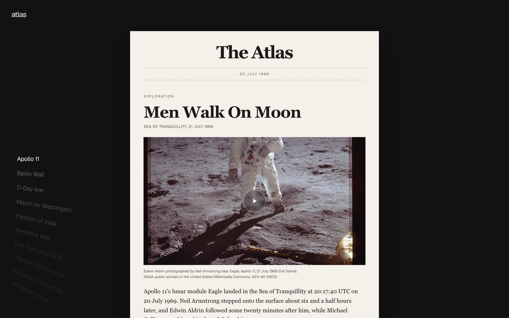
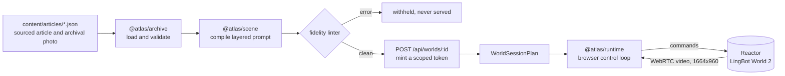
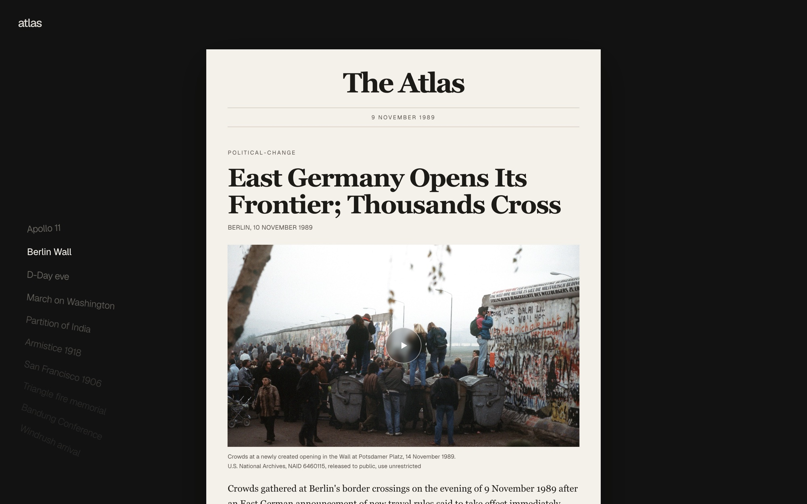
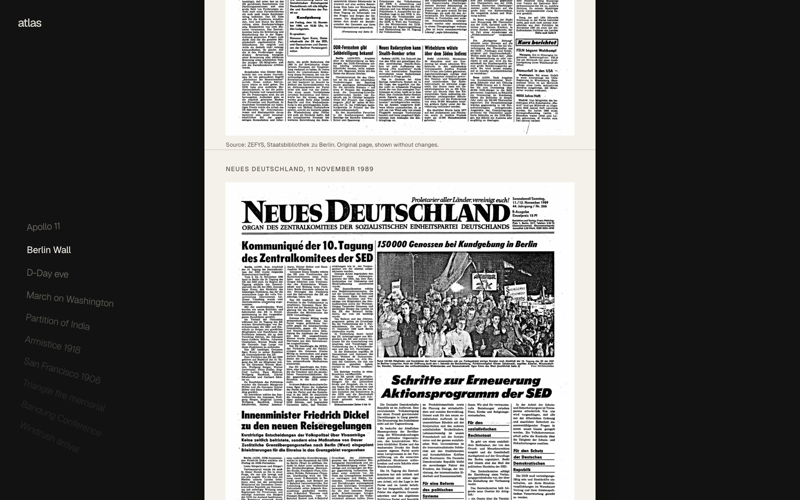
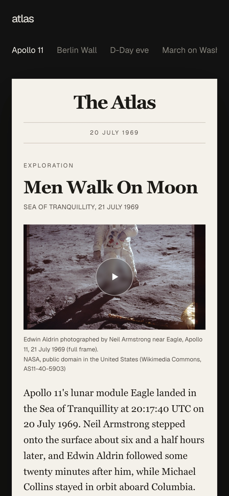
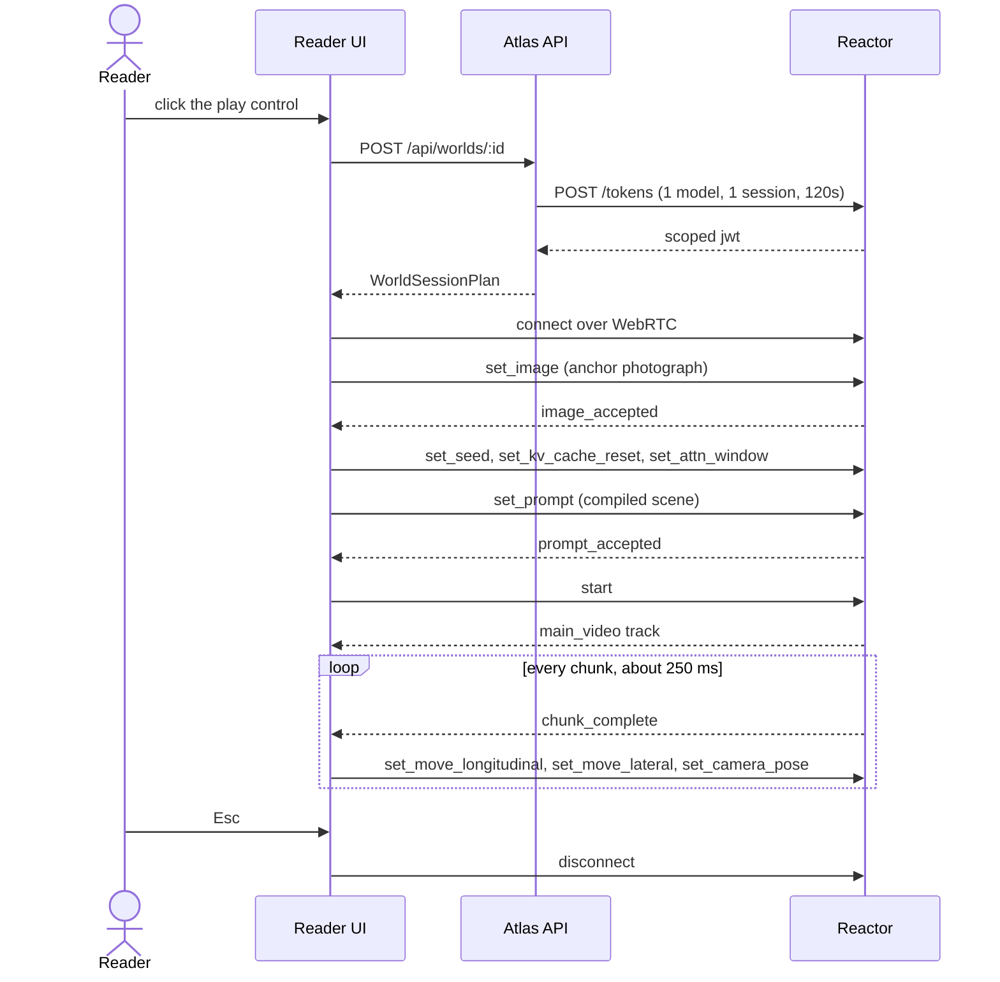
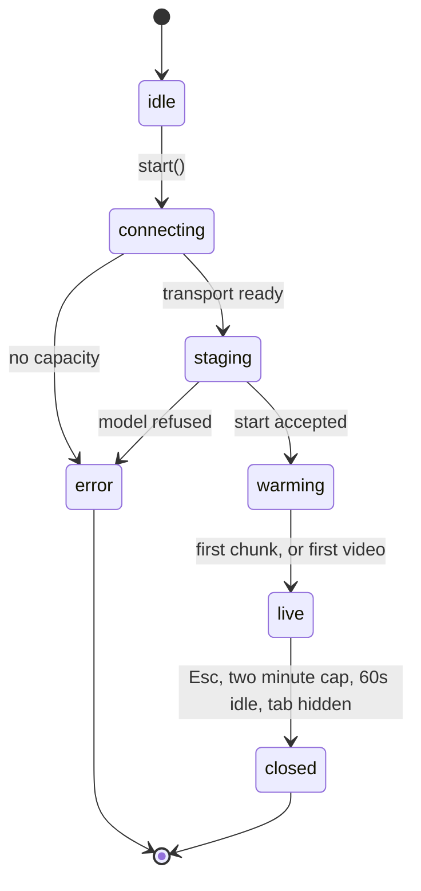

<h1 align="center">Atlas</h1>

<p align="center"><strong>A newspaper you can walk into.</strong></p>

<p align="center">
  
  
  
  
  
  
  
</p>

<p align="center">
  <a href="#why-we-built-this">Why</a> &middot;
  <a href="#what-it-does">What it does</a> &middot;
  <a href="#the-interface">Interface</a> &middot;
  <a href="#run-it">Run it</a> &middot;
  <a href="#controls">Controls</a> &middot;
  <a href="#staying-true-to-the-record">Fidelity</a> &middot;
  <a href="#architecture">Architecture</a> &middot;
  <a href="#documentation">Docs</a>
</p>



---

## Why we built this

History is taught as something you read about. Every format we use to deliver it is losing the
room at once.

| Signal                                                               | Number    | Source                                                                                                                           |
| -------------------------------------------------------------------- | --------- | -------------------------------------------------------------------------------------------------------------------------------- |
| People who still reach news in print, down from around half in 2013  | **10%**   | [Reuters Institute, Digital News Report 2025](https://reutersinstitute.politics.ox.ac.uk/digital-news-report/2025)               |
| People who say they sometimes or often avoid the news, a record high | **40%**   | [Reuters Institute, DNR 2025](https://reutersinstitute.politics.ox.ac.uk/digital-news-report/2025/dnr-executive-summary)         |
| People who trust most news most of the time, flat for three years    | **40%**   | [Reuters Institute, DNR 2025](https://reutersinstitute.politics.ox.ac.uk/digital-news-report/2025/dnr-executive-summary)         |
| US adults getting news from social and video, now ahead of TV at 50% | **54%**   | [Reuters Institute, DNR 2025](https://reutersinstitute.politics.ox.ac.uk/digital-news-report/2025/dnr-executive-summary)         |
| Share of all web traffic that is automated rather than human         | **51%**   | [Imperva, 2025 Bad Bot Report](https://www.imperva.com/blog/2025-imperva-bad-bot-report-how-ai-is-supercharging-the-bot-threat/) |
| Test score lift measured for active learning over passive lecture    | **+54%**  | [Active learning research review](https://www.engageli.com/blog/active-learning-statistics-2026)                                 |
| Information retained after active learning, against 79% when passive | **93.5%** | [Active learning research review](https://www.engageli.com/blog/active-learning-statistics-2026)                                 |

Read those together and the picture is blunt. Nine in ten people have stopped touching print.
Four in ten actively steer around the news. Trust has not moved in three years. Attention has
moved to short video and social feeds, and more than half of what moves through those pipes is
now machines talking to machines rather than people, which is the dead internet thesis stated
as a measurement rather than a mood. Swapping one passive format for another passive format has
not worked, because the problem was never the resolution of the picture. It was that nothing
asked the reader to do anything.

The one intervention with a consistent effect size is participation. Active learning beats
lecture by roughly half again on assessment, and recall holds at 93.5% against 79%. That is the
entire thesis of Atlas: not a better article about the Berlin Wall, but ninety seconds standing
at the Bornholmer Strasse crossing on the night the gate opened, with the sources for every
detail one keypress away.

> [!NOTE]
> The same argument generalises past news. Music, art, migration, disaster, protest: anything
> that happened in a place is easier to hold onto if you have been in a version of the place.
> Atlas treats an archival photograph as the anchor and the citation at the same time.

**Who this is for.** School and university history departments that already pay for textbook
and video licences and get very little engagement data back. Museums and archives sitting on
digitised collections nobody browses. Newsrooms with deep photo morgues and no way to make a
thirty year old story feel present. Every one of them already owns the source material. What
they do not own is a way to let somebody stand inside it, with the provenance intact.

---

## What it does

Each article in the archive carries an archival photograph and a structured scene brief. Atlas
compiles that brief into a layered prompt, refuses to serve it if the prompt cannot be traced
back to a source, mints a short lived scoped token, and hands the browser a plan it can drive.
The reader clicks once and walks around inside the photograph in first person.



Ten events ship in the archive today: Apollo 11, the night the Berlin Wall opened, the eve of
D-Day at Greenham Common, the March on Washington, the midnight of Partition, the Armistice at
Compiegne, the San Francisco relief camps of 1906, the Triangle fire mourning march, the
Bandung Conference, and the Windrush arrival at Tilbury.

---

## The interface

There is no navigation. There is a wordmark, a list of events in the left margin, and a paper
in the middle of the screen that only ever moves up and down.

<table>
<tr>
<td width="50%">



**Scroll the margin, and it opens.**
Whatever the list lands on is already open. There is no second step, no confirm, no read this
first. The list carries no background and no border of its own.

</td>
<td width="50%">



**Original pages continue the same scroll.**
Where a real scan exists it sits under the story rather than behind a page turn, full width,
credited to the library that holds it.

</td>
</tr>
</table>

<details>
<summary><strong>On a phone</strong></summary>



The same single column. The margin list becomes one horizontal row above the paper, so there is
still nothing to open and nothing to dismiss. Inside a world, thumb pads replace the keyboard,
chosen by `(pointer: coarse)` rather than by screen width.

</details>

---

## Run it

```bash
pnpm install
cp .env.example .env          # add your REACTOR_API_KEY (rk_...)
pnpm dev:api                  # the archive and token API, on :3000
pnpm dev                      # the reader, on :5173
```

Open <http://localhost:5173>, pick an event, and click the play control on the photograph.

```bash
pnpm verify                   # lint, typecheck, 230 unit tests
pnpm test:browser             # 8 Playwright tests, Chromium and WebKit
```

> [!IMPORTANT]
> `REACTOR_API_KEY` is read server side only. It is exchanged for a JWT scoped to one model,
> one session, and 120 seconds, and that JWT is the only credential that ever reaches a browser.

---

## Controls

A world runs for at most two minutes, warns at 45 seconds without input, and closes itself at
60 rather than hold a GPU nobody is watching.

| Control             | Does                                                   |
| ------------------- | ------------------------------------------------------ |
| `W` `S`             | walk forward and back                                  |
| `A` `D`             | strafe, or turn on a model with no lateral axis        |
| mouse, or drag      | look; pointer lock is used where the browser grants it |
| two finger trackpad | look, without holding a button                         |
| arrow keys          | look, without a mouse at all                           |
| `space` / `C`       | jump / crouch                                          |
| `1` to `9`          | hold a sourced event from the article                  |
| `Esc`               | leave the world                                        |

Keys are read by physical position (`event.code`), so `WASD` lands in the same place on QWERTY,
AZERTY and Dvorak. Where a browser reports no physical key at all, which happens on remote
desktops, some virtual keyboards and several IMEs, the binding falls back to the character
(`event.key`) rather than going silently dead.

---

## Staying true to the record

The world is generated, so accuracy has to be engineered rather than hoped for.

- Every world is **anchored on a real archival photograph**, cropped to the model's native
  1664x960 frame, with its licence and credit preserved and shown.
- Prompts are **compiled from structured briefs**, never hand written, with landmarks pinned by
  explicit count and camera behaviour bound to reader input.
- A **fidelity linter** blocks absence phrasing, camera direction outside the camera layer,
  over budget prompts, and any hold key event that cannot cite a source. `pnpm test` fails if
  the shipped archive produces so much as a warning.
- Sensitive events carry a **content note** stating what the world deliberately does not stage.
  The Triangle fire world is the mourning march ten days later. The D-Day world is the airfield
  the evening before.
- Seeds are fixed, so the same article renders the same world every time.
- The reader is told, in the article itself, that the world is a reconstruction and not footage.

---

## Architecture



The browser never holds more state than the model does. Every `state` message from the model
corrects what the runtime believed was on the wire, so a command the model quietly dropped is
re-sent on the next chunk instead of desyncing the session forever.



### Repository layout

| Package          | Responsibility                                                                       |
| ---------------- | ------------------------------------------------------------------------------------ |
| `@atlas/schema`  | zod contracts for articles, scene briefs, sessions and control state                 |
| `@atlas/scene`   | compiles a brief into layered prompts, composes them, lints them for fidelity        |
| `@atlas/archive` | loads and validates the local JSON archive, withholds unservable articles            |
| `@atlas/world`   | Reactor model registry, command vocabularies, token minting, session planning        |
| `@atlas/runtime` | browser control loop: transport, input, camera pose, chunk clock, touch, React hooks |
| `@atlas/briefs`  | the event brief pipeline that turns research into a scene brief                      |
| `@atlas/ingest`  | optional side channel: post an article, or draft one from a news URL                 |
| `apps/web`       | the reader, the product surface                                                      |
| `apps/api`       | the archive and world-session API, and nothing else                                  |

### HTTP API

| Route                       | Does                                                          |
| --------------------------- | ------------------------------------------------------------- |
| `GET /api/articles`         | the servable archive, plus any withheld files and why         |
| `POST /api/worlds/[id]`     | mints a scoped Reactor token and returns a `WorldSessionPlan` |
| `GET /api/images/[...path]` | serves archive images, including the anchor frame             |
| `POST /api/ingest`          | optional, off unless `ATLAS_INGEST_ENABLED=true`              |

### Driving the runtime from another frontend

```tsx
const { session, snapshot } = useWorldSession(plan, { autoStart: true })
const bindVideo = useWorldViewport(session)
const bindSurface = useWorldControls(session, plan)

<div ref={bindSurface} tabIndex={0}>
  <video ref={bindVideo} muted playsInline autoPlay />
</div>
```

---

## Documentation

| Document                                         | Covers                                                           |
| ------------------------------------------------ | ---------------------------------------------------------------- |
| [System design](documentation/system-design.md)  | the problem, the constraints, and why the pieces are shaped so   |
| [Architecture](documentation/architecture.md)    | package boundaries, the control loop, and the session lifecycle  |
| [Data layer](documentation/data-layer.md)        | the archive format, validation, provenance and the fidelity gate |
| [Cost to run](documentation/cost.md)             | what a session costs, and every guard that keeps it bounded      |
| [Audience and market](documentation/audience.md) | who this is for, and what they are already paying for            |
| [Authoring an article](content/README.md)        | how to add an event to the archive                               |

---

## Credits

Every photograph and every scan in the archive is public domain or openly licensed, and carries
its credit in the interface, in the article JSON, and in the scene brief that references it.
Sources include NASA, the US National Archives, Wikimedia Commons, Trove at the National Library
of Australia, the Internet Archive, and ZEFYS at the Staatsbibliothek zu Berlin.

Worlds are generated by [LingBot World 2](https://docs.reactor.inc/model-api-reference/lingbot-world-2/schema)
through [Reactor](https://reactor.inc). They are reconstructions, not footage.
