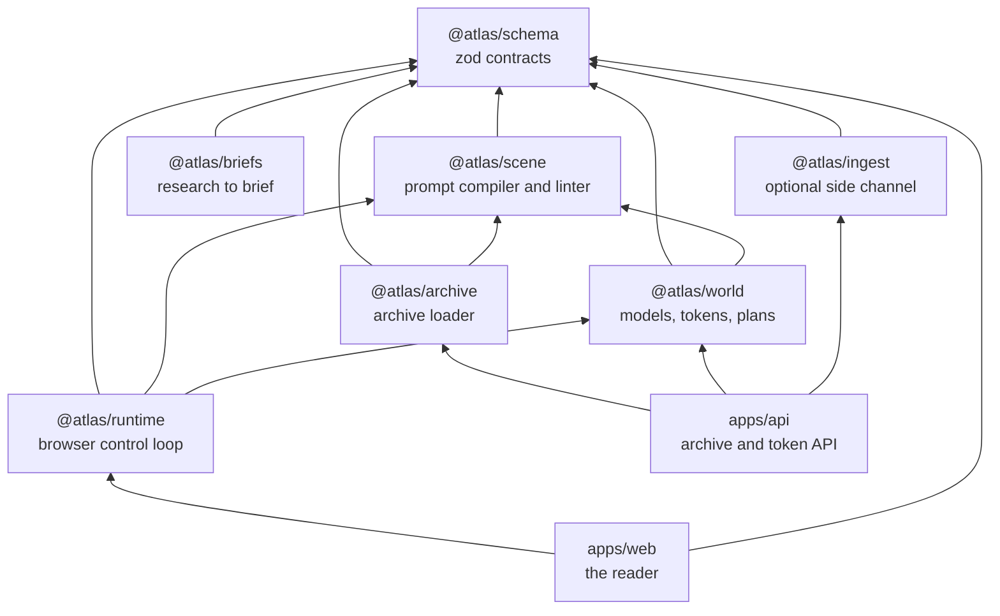
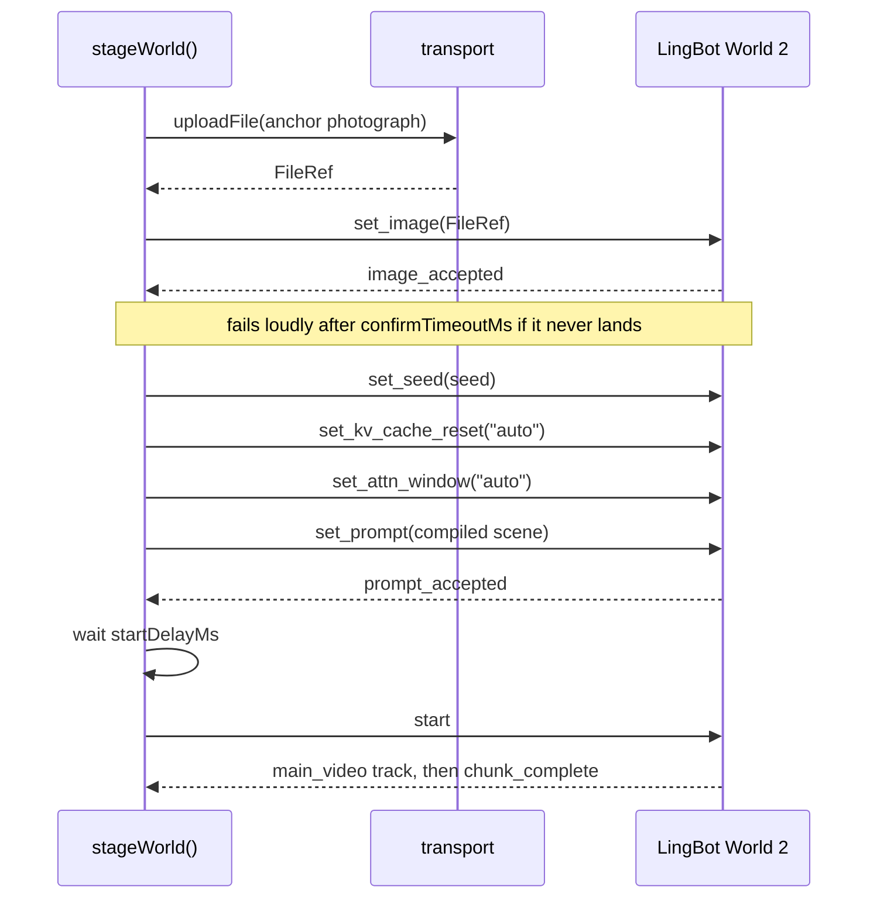
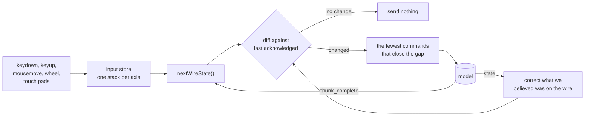
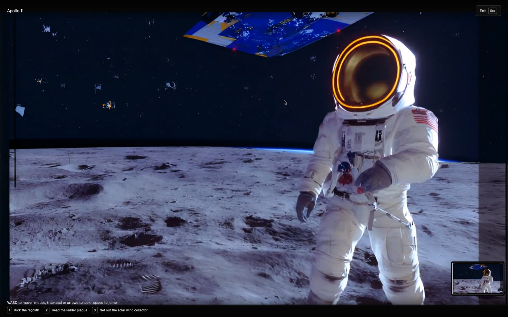
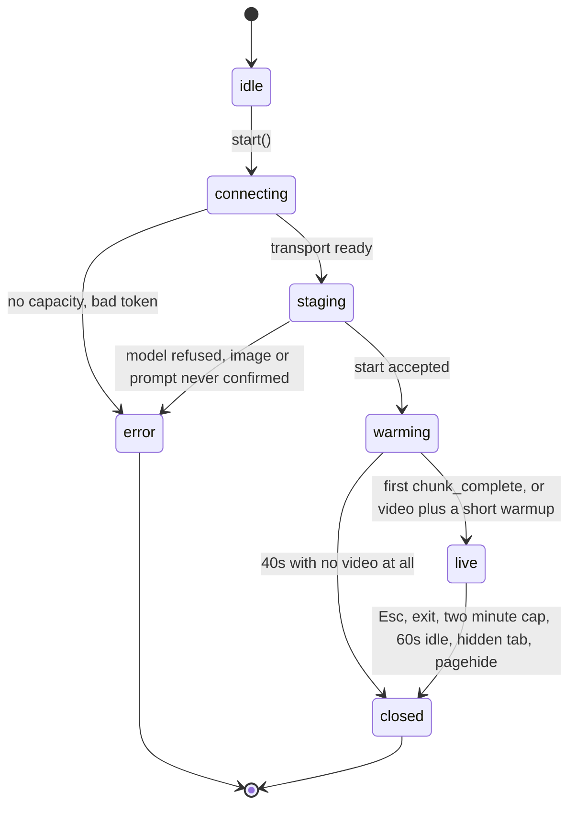

# Architecture

## Package graph

Every package ships TypeScript source rather than a build artifact, so a change is visible to
every consumer in one step and there is no build order to keep in your head.

The arrows only ever point down the stack. `@atlas/schema` knows about nothing.
`@atlas/runtime` is the only package that imports the Reactor SDK, so swapping providers is a
transport change and not an application change.

## The two processes

| Process    | Port   | Holds                                  | Never holds       |
| ---------- | ------ | -------------------------------------- | ----------------- |
| `apps/api` | `3000` | `REACTOR_API_KEY`, the archive, images | any browser state |
| `apps/web` | `5173` | the compiled reader, a scoped JWT      | the API key, ever |

In development the reader proxies `/api` to the API process. In production both sit behind one
origin, so the browser makes a same origin request and no CORS is involved.

## Staging a world

`start` is refused by the model unless both a prompt and an image have landed, so every step is
confirmed from the model's own event stream rather than assumed from a resolved promise.

## The control loop

Movement is persistent state on the wire. Every keydown has to have a matching keyup or the
world keeps walking, so input is held as a stack per axis and the wire is driven by a diff
rather than by events.

Three decisions in there are worth calling out.

**Top of stack wins.** Press `W`, then `S`, then release `S`, and the reader keeps walking
forward. A naive last event wins implementation stops dead, which feels broken.

**The model's `state` message is the truth.** A command the model quietly dropped would
otherwise desync the runtime forever, and the symptom is the worst possible one: `W` stops
moving and nothing in the logs says why. Every `state` message overwrites what the runtime
believed was on the wire, so the next diff re-sends whatever is actually missing.

**Looking runs through the camera pose channel.** LingBot World 2 takes per latent
`[rx, ry, rz, tx, ty, tz]` deltas. Mouse movement accumulates between chunks and converts to one
rotation per chunk, capped at `maxRotationPerLatentRad`, with a bounded backlog so a fast flick
turns further than one chunk without spinning for seconds. Once a pose is active its rotation
overrides the arrow look axes, so releasing look means sending `camera_pose: []` exactly once.

## Keyboard binding

Keys are resolved from `event.code`, which is layout independent, so `WASD` is the same four
physical keys on QWERTY, AZERTY and Dvorak.

Some environments deliver a keydown with no `code` at all: remote desktops, several virtual
keyboards, some IMEs, and synthetic events. Reading only `event.code` there leaves every control
silently dead, which is indistinguishable from a broken world, so the binding falls back to
`event.key`. A focused button inside the world chrome keeps `space` and `enter` for itself but
does not swallow `WASD`.

## Session lifecycle

The `warming` state exists because a session sometimes streams video before it reports a chunk.
Waiting only on `chunk_complete` leaves a reader staring at a moving world whose controls do
nothing, so video plus a short warmup also unlocks the controls.

## Testing strategy

| Layer                     | How it is tested                                                   | Needs a GPU |
| ------------------------- | ------------------------------------------------------------------ | ----------- |
| Contracts, compiler, lint | Unit tests over the real shipped archive                           | no          |
| Token minting             | Unit tests against a fake `fetch`                                  | no          |
| Control loop and session  | Unit tests against a fake transport that replays model messages    | no          |
| Reader UI and world entry | Playwright, Chromium and WebKit, with the provider routed to a 429 | no          |
| The world itself          | Manual, against the live provider                                  | yes         |

The Playwright suite deliberately routes `https://api.reactor.inc/**` to a capacity refusal. That
exercises the real SDK, the real wasm loader and the real error path end to end, and allocates
no GPU, so the browser suite is safe to run in CI on every commit.
