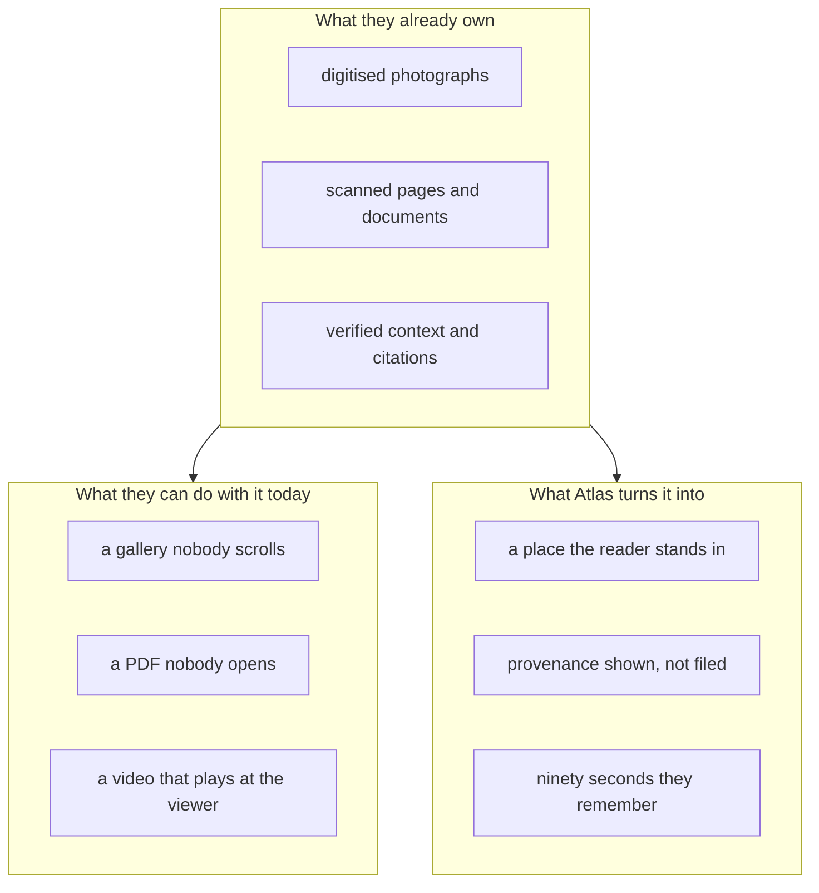

# Audience and market

## The gap this sits in

Everyone in the business of the past is holding the same two things: a large collection of
material nobody browses, and a delivery format that is losing the room.

The material is not the bottleneck. Nobody needs to shoot new footage of 1918. The bottleneck is
that the only way to deliver an archive has been to show it, and showing is the weakest verb
available.

## Who buys this

### Schools and universities

The primary market. History departments already pay per seat for textbooks, streaming video and
primary source databases, and get almost no engagement signal back.

- The measured case for participation is not marginal: roughly **half again on assessment**, and
  **93.5% recall against 79%** for passive delivery.
- A lesson is 50 minutes. Three worlds per student is $1.26 of GPU at list price, which is
  inside the noise of what a school already spends per student per lesson on licensed material.
- Curriculum fit is direct. The shipped archive is already ten set texts: Apollo 11, the Berlin
  Wall, D-Day, the March on Washington, Partition, the Armistice, San Francisco 1906, the
  Triangle fire, Bandung, and Windrush.
- The content notes are a feature, not a disclaimer. A department cannot adopt a tool that might
  stage an atrocity. Atlas states in the interface what each world deliberately does not stage.

### Museums, archives and libraries

They hold the scans. ZEFYS, Trove, the National Archives and the Internet Archive already serve
the exact material this archive cites, and their reach problem is the same one the news industry
has: the collection is open and almost nobody opens it.

The sell here is not a new exhibit. It is a layer over the collection they already digitised,
where every world is anchored on one of their own frames and carries their credit on screen.

### Newsrooms and publishers

Photo morgues are dead capital. A thirty year old story has a photograph, a byline and no way to
feel present. Atlas is a format for the anniversary piece, the explainer and the retrospective,
built from assets the publisher already owns and already cleared.

### Adjacent, and deliberately not built yet

Music history, art history, migration history, disaster response training, heritage tourism. The
pipeline does not know it is about news. It knows how to turn a cited photograph and a structured
brief into a place. Anything with an archival frame and a rights holder fits.

## Why now

| Shift                                                     | Evidence                                        |
| --------------------------------------------------------- | ----------------------------------------------- |
| Print delivery has effectively ended                      | 10% reach, down from around half in 2013        |
| The audience is actively steering away, not just drifting | 40% avoid the news sometimes or often, a record |
| Trust has stopped responding to format changes            | 40%, flat for three years                       |
| Attention moved to feeds that are now majority machine    | 51% of web traffic is automated                 |
| Real time world models became a per second API            | $0.007 per second, no GPU to own                |

The first four are the reason. The fifth is the reason it is possible this year and was not
possible two years ago. Building a walkable 1989 Berlin used to be a studio budget. It is now
forty two cents.

## What we are not claiming

- This does not replace reading. The article is still an article, with sources.
- This is not footage. Every world says so, in the interface, in the same place as the sources.
- This is not an engagement product. There is no feed, no recommendation and no session length
  to maximise. The world closes itself at two minutes on purpose.

## The pitch in one line

Every institution holding a historical photograph is holding a door. Atlas is the handle.
