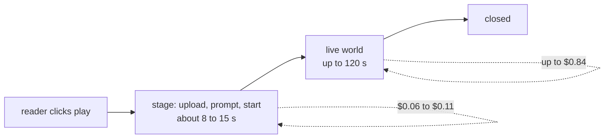

# Cost to run

## The one number that matters

A world is a live GPU. Everything else in this project is rounding error next to it.

| Item                          | Rate                                | Source                                                                    |
| ----------------------------- | ----------------------------------- | ------------------------------------------------------------------------- |
| LingBot World 2, 960p, 16 fps | **$0.007 per second**               | [Reactor model page](https://www.reactor.inc/models/lingbot-world-2/info) |
| the same, per minute          | **$0.42**                           | same                                                                      |
| the same, per hour            | **$25.20**                          | same                                                                      |
| token minting                 | free                                | billed on session time, not on requests                                   |
| the reader bundle             | static files, no server rendering   | pennies per month on any static host                                      |
| the archive API               | one small Node process, no database | the smallest instance any host sells                                      |

Figures taken from Reactor's published model page. Treat them as the current list price, not a
contract.

## What a session costs

| Case                                        | Duration | Cost      |
| ------------------------------------------- | -------- | --------- |
| Reader opens a world and leaves immediately | ~15 s    | **$0.11** |
| Reader looks around, then exits             | ~45 s    | **$0.32** |
| Reader stops interacting, idle close fires  | 60 s     | **$0.42** |
| Reader stays for the whole thing, hard cap  | 120 s    | **$0.84** |

**$0.84 is the ceiling.** There is no path through the code that produces a more expensive
session, because the cap is enforced in two independent places: the browser closes the session
at `maxSessionMs`, and the token itself is minted with `max_session_duration_seconds: 120`, so a
browser that lied or crashed still cannot hold the GPU past two minutes.

## Every guard, and what it is worth

| Guard                                          | Where            | Without it                                           |
| ---------------------------------------------- | ---------------- | ---------------------------------------------------- |
| Two minute hard cap                            | client and token | A forgotten tab costs **$604.80 a day**              |
| Idle close at 60 s, warned at 45 s             | client           | A reader who walks away pays to the cap              |
| Close on `pagehide` and hidden tab             | client           | A closed laptop keeps a GPU until the server cap     |
| Release after 40 s with no video at all        | client           | Paying for a session that never renders anything     |
| One token, one session (`max_sessions: 1`)     | server           | A leaked token could open sessions in a loop         |
| Single flight: one click is one attempt        | client           | Impatient double clicks bill twice                   |
| Give up after two refusals of the same command | client           | A refusal loop burns the whole session doing nothing |

The single flight guard is easy to underrate. Before it existed, three clicks on a slow network
opened three billed sessions for one reader. That is a 3x cost multiplier hiding inside a UI
detail, and it is covered by a browser test.

## Modelled scenarios

Assuming the realistic **$0.42** average rather than the ceiling.

| Scenario                                                    | Sessions | GPU cost       |
| ----------------------------------------------------------- | -------- | -------------- |
| One reader exploring the whole archive, one world per event | 10       | **$4.20**      |
| A class of 30, three worlds each, one lesson                | 90       | **$37.80**     |
| A school of 600, three worlds each, once a month            | 1,800    | **$756/month** |
| A hackathon demo booth, 40 judges and passers by            | 40       | **$16.80**     |
| A museum kiosk running continuously, 6 hours a day          | n/a      | **$151/day**   |

The kiosk line is the interesting one. Continuous interactive generation is the wrong shape for
an always on exhibit, and the honest answer there is not to run live: record a clip per event
once and loop it, and reserve the live world for a visitor who actually presses the button.
Reactor exposes clip recording for exactly that, and the runtime already has the transport.

## Fixed costs

| Item                                                          | Monthly               |
| ------------------------------------------------------------- | --------------------- |
| Static hosting for the reader                                 | $0 to $5              |
| One small instance for the API                                | $5 to $10             |
| Object storage for the archive, once it leaves the repository | under $1 at this size |
| Domain                                                        | about $1              |

Under $20 a month before a single world opens. The business model writes itself: the fixed cost
is negligible, and the variable cost is a known, hard capped $0.84 per interaction, which makes
per seat pricing straightforward to underwrite.

## Where cost would go if this grew

1. **Queueing, not scaling.** The binding constraint is GPU availability, not CPU. Capacity
   refusals already happen today and the reader is told plainly. At scale a click takes a ticket.
2. **Caching the first frames.** Staging costs 8 to 15 seconds of GPU before the reader has any
   agency. Replaying a recorded opening while the live session stages would cut roughly a fifth
   off every session's bill.
3. **Resolution as a lever.** The model also serves 480p. For a classroom projected on a wall,
   960p is not buying anything a reader can see.
