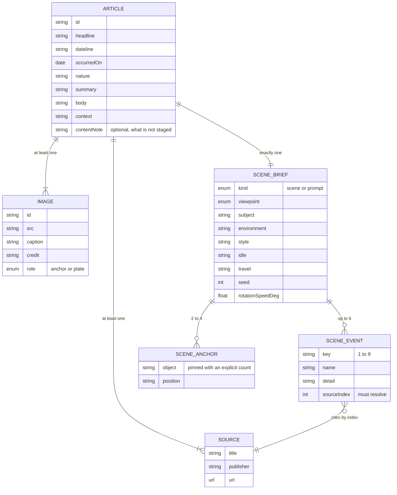
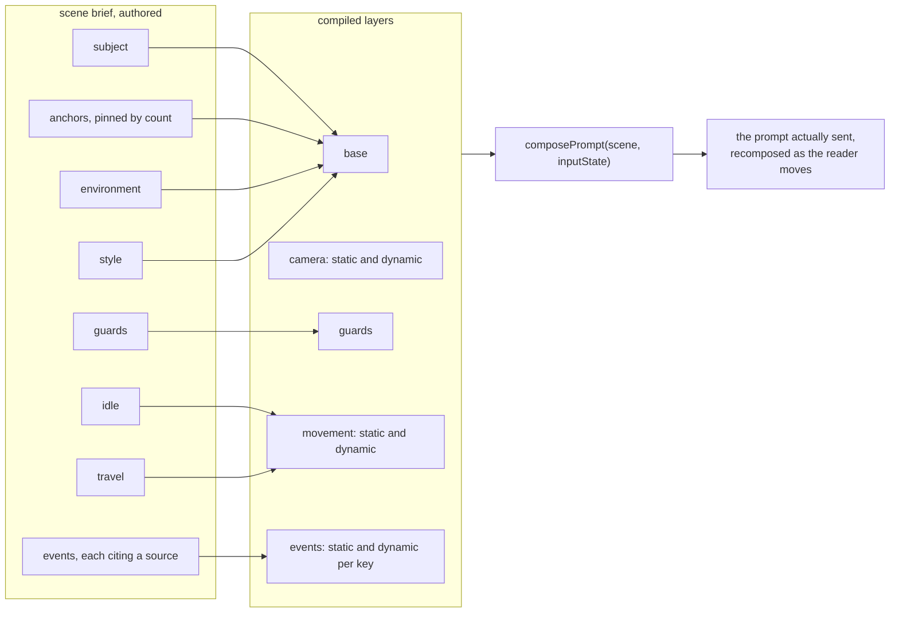
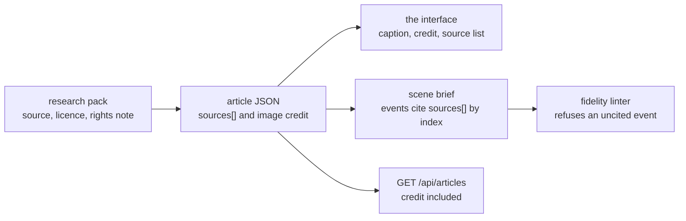

# Data layer

## Where the data lives

The archive is a directory of files, not a database. Ten events today.

```
content/
  articles/<id>.json     the article and its scene brief, one file per event
  images/<id>/*.jpg      the archival photographs, one directory per event
  narratives/            long form editorial notes for an event
```

There is no migration, no ORM and no connection string, because the archive is read only at
runtime and small enough to validate in full on every test run. That is a deliberate trade. It
buys a property that matters more than write throughput: **if a file is malformed, the test
suite fails before anything ships**, and if a single file is malformed in production the rest of
the archive still serves.

## The contract

Everything is a zod schema in `@atlas/schema`, so the same type checks at the API boundary, in
the compiler, and in the browser.



Two invariants are enforced by the schema itself rather than by convention:

- **Exactly one image carries `role: "anchor"`.** That image is the frame the world model
  conditions on. Zero anchors means no world. Two anchors means an ambiguous world.
- **Every hold key event cites a source by index into the article's own source list.** An event
  whose `sourceIndex` does not resolve is not a validation warning, it is a build failure.

## From brief to prompt

An authored brief is not a prompt. It is one slot per prompt layer, and the compiler composes
them. This is the difference between a scene that can be reviewed and a scene that can only be
tried.



The prompt is recomposed as input state changes. Standing still uses the `idle` clause, walking
uses `travel`, and holding a number key appends that event's detail. The reader is changing the
prompt by moving, which is why the prompt has to be assembled from parts rather than written as
one string.

## The fidelity gate

Ten rules run over every compiled scene. Errors withhold the article. Warnings fail `pnpm test`
for the shipped archive, so nothing lands with a known smell.

| Rule                        | Severity | Catches                                                                   |
| --------------------------- | -------- | ------------------------------------------------------------------------- |
| `budget/composed`           | error    | A composed prompt over the model's character budget                       |
| `prose/negation`            | error    | Absence phrasing, which world models tend to render as presence           |
| `prose/camera-language`     | error    | Camera direction leaking outside the camera layer                         |
| `events/attested`           | error    | A hold key event with no resolvable source                                |
| `budget/layer`              | warning  | A single layer that has grown past its share                              |
| `prose/motion-verb-in-base` | warning  | Motion described in the base layer, where it cannot be switched off       |
| `prose/intent-qualifier`    | warning  | Hedging that gives the model room to improvise                            |
| `anchors/pinned`            | warning  | A landmark without an explicit count, which the model will duplicate      |
| `events/definite-reference` | warning  | An event detail that refers to something the base layer never established |
| `movement/generic-idle`     | warning  | An idle clause with no content of its own                                 |

A withheld article is not hidden. `GET /api/articles` returns the servable archive **and** the
withheld files with the reason each one failed, so an editor can see what to fix.

## Provenance, end to end

Credit is not metadata that lives in a spreadsheet. It travels with the data and is rendered.



Every photograph in the shipped archive is public domain or openly licensed. The archival page
scans carry the holding institution in the caption: Trove at the National Library of Australia,
the Internet Archive, the US National Archives, and ZEFYS at the Staatsbibliothek zu Berlin.

## Runtime data, and what is not stored

| Data                       | Where it lives     | Lifetime                      |
| -------------------------- | ------------------ | ----------------------------- |
| Articles, images, briefs   | The repository     | Permanent, version controlled |
| `REACTOR_API_KEY`          | Server environment | Never leaves the server       |
| Scoped session JWT         | Browser memory     | 120 seconds, one session      |
| Session snapshot and input | Browser memory     | Until the world closes        |
| Reader identity, analytics | Nowhere            | Not collected                 |

There is no user table, no session store, no cookie and no tracking. A world is a two minute
conversation between one browser and one GPU, and nothing about it is written down.
