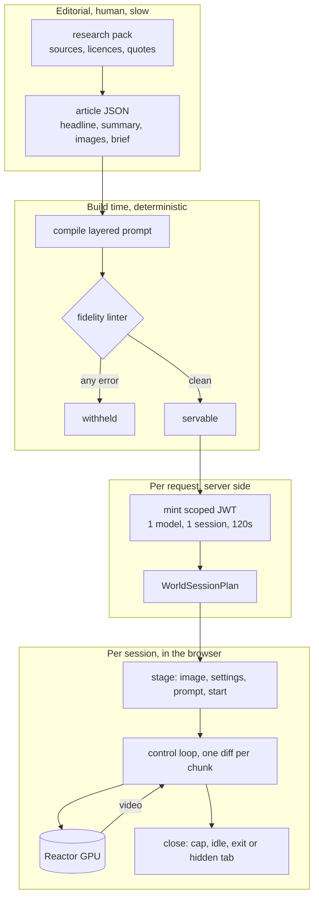
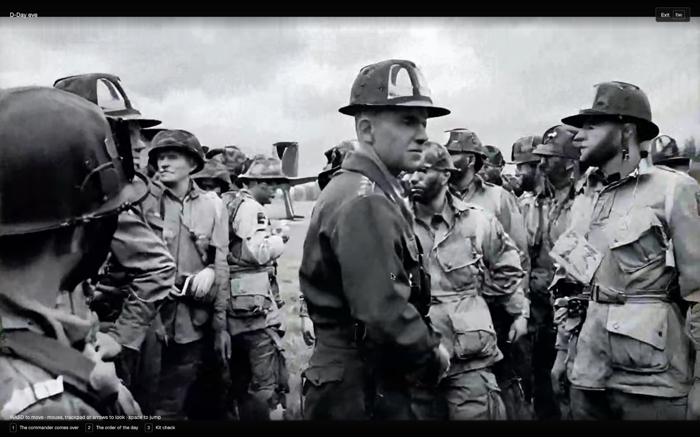

# System design

## The problem, stated precisely

A historical event is a place, a time, and a set of things that were true at that place and
time. Every medium we currently use to deliver one throws away the first of those three. A
paragraph describes a place. A photograph shows one frame of a place. A documentary shows a
camera operator's path through a place. None of them let the reader look left.

That limitation used to be a hardware fact. Building a walkable 1969 lunar surface or a 1989
Berlin border crossing meant an art team, months, and a budget that only a studio could carry.
Real time world models removed the cost of the place, and left behind a much harder problem:
a generated place will confidently invent things that were not there.

So Atlas is not a rendering problem. It is a provenance problem wearing a rendering problem's
clothes. The interesting engineering is not "can we generate 1969", it is "can we generate only
the 1969 that a source will attest to, and refuse to serve the rest".

## Constraints we designed against

| Constraint                                | Consequence                                                                               |
| ----------------------------------------- | ----------------------------------------------------------------------------------------- |
| A generated world will hallucinate        | Prompts are compiled from structured briefs, never written by hand, and linted before use |
| A GPU session costs real money per second | Two minute hard cap, 60 second idle close, one session per token, closed on a hidden tab  |
| An API key must never reach a browser     | The key is exchanged server side for a JWT scoped to one model and one session            |
| A reader on a phone has no keyboard       | Touch pads, selected by pointer type rather than by screen width                          |
| History includes atrocity                 | Sensitive events are staged adjacent to the harm, and say so in a content note            |
| Judges and teachers must verify claims    | Every credit and licence is carried in the data and shown in the interface                |

## What we deliberately did not build

- **A general world builder.** There is no prompt box. A reader cannot type a scene. The only
  worlds that exist are the ones an editor wrote a sourced brief for.
- **A feed.** No infinite scroll, no recommendations, no engagement loop. Ten events, a list,
  and a paper.
- **Narration, music or a soundtrack.** An earlier build had a gated historical soundscape. It
  was removed, because no source in the archive licenses audio for the moments we stage, and a
  sound effect that is not attested is a fabrication with a nicer surface.
- **A cinematic on rails.** An earlier build drove the reader through a scripted camera path
  over a 3D newspaper. It was cut. If the point is that the reader can look left, a camera that
  looks for them defeats the entire argument.

## Why the shape is the shape

The boundary that matters is between **Build** and **Request**. Everything above it is
deterministic and testable with no network and no GPU, which is why 230 unit tests can assert
that the shipped archive produces a clean, in budget, fully sourced prompt for all ten events
without ever spending a cent. Everything below it is I/O that can fail, and every failure has a
named, readable outcome rather than a black screen.

## Staging next to the harm, not on it

The D-Day world is Greenham Common on the evening of 5 June 1944, which is exactly what the
anchor photograph documents: Eisenhower among the paratroopers of the 101st Airborne, hours
before the drop. The landings and their casualties are in the article, in prose, with sources.
They are not staged, and the article says so in its content note rather than leaving a reader to
discover the omission.

That rule generalises. The Triangle fire world is the mourning march ten days later, not the
building. A world is allowed to be the moment the archive photographed, and nothing else.

## Failure is a first class output

A generated world has many more ways to fail than a web page. The runtime treats each one as a
state the reader can be told about, not an exception to swallow.

| Failure                                      | What the reader sees                                                                  |
| -------------------------------------------- | ------------------------------------------------------------------------------------- |
| Provider has no free GPU                     | "Reactor has no free servers for this model right now. No world started."             |
| Token rejected, credits exhausted, no access | A distinct sentence per status, naming the account level cause                        |
| Model refuses a command                      | The refusal is surfaced, the wire state is re-diffed, and it gives up after 2 retries |
| Video never arrives                          | The session releases the GPU after 40 seconds and says the world never sent video     |
| Reader walks away                            | Warned at 45 seconds, closed at 60                                                    |
| Reader hides the tab, or closes the laptop   | The session closes on `pagehide` and `visibilitychange`                               |

## What would change at scale

Nothing in the pipeline assumes ten events. The archive is a directory of JSON files validated
by a zod contract, so the same loader serves ten or ten thousand. Two things would need to move:

1. **The archive would leave the repository.** Articles and images would move to object storage
   behind the same loader interface, with the fidelity gate run at publish time rather than at
   test time.
2. **Token minting would become a queue.** Today a click mints a token and connects. At scale a
   click would take a ticket, because the binding constraint is GPU availability, and a reader
   who is told "you are third in line" is happier than one told "no capacity".

Neither changes the contract the browser sees, which is `WorldSessionPlan` and nothing else.
